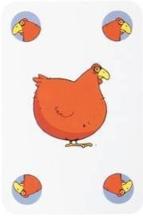
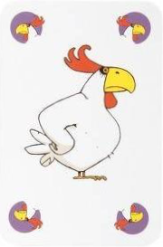
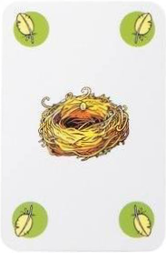
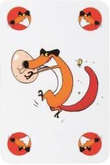
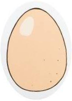
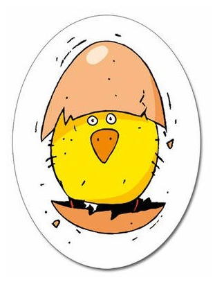
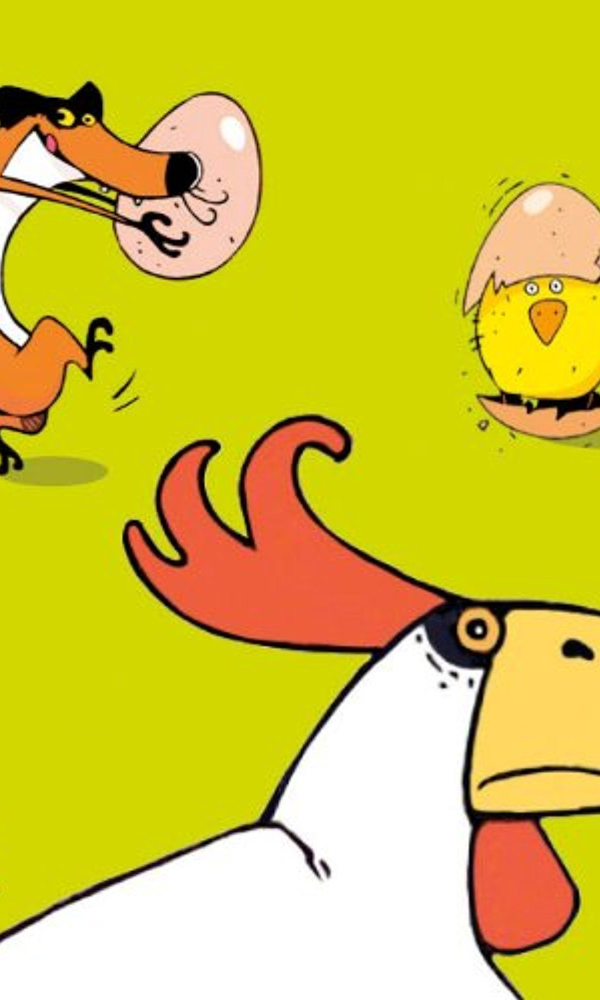

# Piou Piou
### Panic in the hen house, the fox is on the prowl and the eggs have not yet hatched...
 
When it is his turn to play, the player chooses:

1. to throw a card into the pot 
2. to carry out one of the game actions
 
### Game actions:
- Lay an egg (by presenting the 3 cards - **hen**, **rooster**, **nest,** the player may take an **egg** card). He places it in front of him, **egg** side up.
- Give birth to a **chick** (the player presents 2 **hen** cards whilst imitating a hen's cry.) Turns over one of his **eggs** to make a newborn **chick** appear. 
- Take an **egg** from another player (the player presents a **fox** card to an advesary, and ask him for an **egg** card (not a chick). The adversary may counter-attack by presenting 2 **rooster** cards.

**The winner is the first to manage to get 3 chicks.**

**NB!** One cannot lay an egg or produce a chick immediately after having picked out a card!
 
 

      